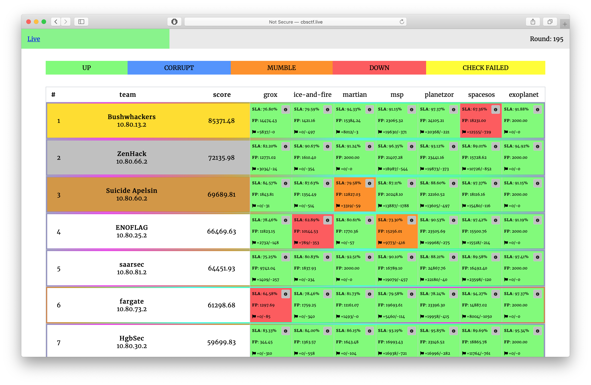

# Stay ~/ CTF 2020

The contest was held on April 12, 2020.

Repository contains source code of services, checkers and sploits.

[CTFTime.org event page](https://ctftime.org/event/1024)

## Results

[Full scoreboard](scoreboard/full.png)

## Services

| Service | Language | Checker | Sploits | Authors |
|---------|----------|---------|---------|---------|
| **[grox](services/grox/)** | NodeJS & Rust | [Checker](checkers/grox/) | [Sploits](sploits/grox/) | [@kekov](https://github.com/xmikasax) |
| **[ice-and-fire](services/ice-and-fire/)** | Assembler | [Checker](checkers/ice-and-fire/) | [Sploits](sploits/ice-and-fire/) | [@pomo_mondreganto](https://github.com/pomo-mondreganto) & [@kekov](https://github.com/xmikasax) |
| **[martian](services/martian/)** | C++ | [Checker](checkers/martian/) | [Sploits](sploits/martian/) | [@revker](https://github.com/revervand)|
| **[msp](services/msp/)** | Python3 | [Checker](checkers/msp/) | [Sploits](sploits/msp/) | [@derlafff](https://github.com/derlaft) |
| **[planetzor](services/planetzor/)** | Golang | [Checker](checkers/planetzor/) | [Sploits](sploits/planetzor/) | [@jnovikov](https://github.com/jnovikov) & [@keltecc](https://github.com/keltecc) |
| **[spacesos](services/spacesos/)** | Dart & PHP | [Checker](checkers/spacesos/) | [Sploits](sploits/spacesos/) | [@jnovikov](https://github.com/jnovikov) & [@alagunto](https://github.com/Alagunto) |
| **[exoplanet](services/exoplanet/)** | C# | [Checker](checkers/exoplanet/) | [Sploits](sploits/exoplanet/) | [@keltecc](https://github.com/keltecc) |

## Infrastructure

- DevOps: [@pomo_mondreganto](https://github.com/pomo-mondreganto)
- Checksystem: [ForcAD](https://github.com/pomo-mondreganto/ForcAD)

## Writeups

- [msp](/writeups/msp/)
- [spacesos](/writeups/spacesos/)

Coming...

## Donation

We organize our CTFs and trainings on a regular basis. Though our infrastructure is cost-optimized, it is not 0. So we are open for donations if you want to support us. Vulnbox costs ~3$ per team.

Paypal: https://www.paypal.me/pomomondreganto

Tinkoff (roubles or if you have a multi wallet card): https://www.tinkoff.ru/sl/3JBSc9Kgiy0

DStream: https://donate.stream/cbsctf

Bitcoin: 1F6XjKjCMvHseScedHyH2xFpLybFGAfgZP
